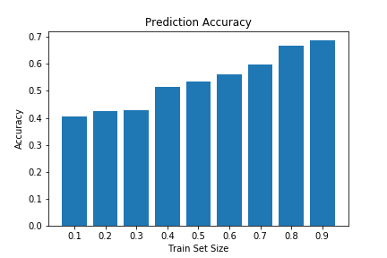

```{r setup, include=FALSE}
knitr::opts_chunk$set(echo = FALSE)
```


## Introduction

In high school wrestling, manual ranking processes are commonplace and waste an excessive amount of time and
effort that could be saved using some sort of automated ranking system. Anecdotal evidence suggests that, on
average, 1-2 hours are spent at each wrestling meet manually ranking the competing wrestlers before
any bouts can even begin. This is time that could otherwise belong to the coaches, wrestlers, and families
involved with the sport if a reliable automated ranking system were utilized. Thus, there exists much
potential value in developing ranking algorithms for use on high school wrestling data, especially when
implementing those algorithms in a user-friendly format easily deployable by coaches and wrestlers. Additional
requirements for such ranking algorithms include easily updatable rankings as well as a sensible cold-start
ranking methodology for wrestlers without previous matches. To satisfy these requirements, we follow
suggestions from previous wrestling ranking literature and develop an Elo rating system to rank the wrestlers
in our dataset, testing our rankings by predicting the winners of already completed matches and comparing
those predictions to the true winners of those matches. 

## Literature Review

We consulted a research article titled ["Ranking and Prediction of Collegiate Wrestling"](https://content.iospress.com/articles/journal-of-sports-analytics/jsa0024)
written by University of Iowa affiliates Kristina Gavin Bigsby and Jeffrey W. Ohlmann and published in April
2017 in the Journal of Sports Analytics. In this paper, Bigsby and Ohlmann investigate various collegiate
wrestling ranking methods, including win percentage and Elo ratings, using data from the 2013-2014 NCAA
Division I wrestling season. Their analysis suggests that "Elo presents an especially attractive alternative
to current ranking systems for college wrestling." Building off Bigsby and Ohlmann's promising results, we
implement an Elo rating method on our high school wrestling data to investigate the algorithm's efficacy at
the lower competitive level. 

## Material and Methods

### Dataset

For this project, we scraped [trackwrestling.com](http://trackwrestling.com) for recent data from the
2019-2020 High School Boys Wrestling season of the New York State Public High School Athletic Association. See
our code on [GitHub](https://github.com/ungersk1998/spring2020-WrestlingRankingResearch) for full details on
the webscraping and data preparation used in this project. From our raw data, we filtered out matches with
non-competitive victory types, such as forfeit, injury, disqualification, and bye. This resulted in a final
dataset that includes 6630 individual wrestling matches, each containing names of the winning and losing
wrestlers as well as their weight class and schools, along with information on the event name and date and the
points awarded to the wrestlers during the match. 3868 unique wrestlers make up the competitors in these 6630
matches. One very important note regarding this data is that it does not contain a full season of matches; due
to complications with scraping data from [trackwrestling.com](http://trackwrestling.com), our earliest records
are only from late January 2020, well into the New York State high school wrestling season. As such, we
believe that all of our results, although already promising, could be much better realized in the future, when
we can track a season fully from its start to have more ideal data. 

### Algorithms

The primary prediction algorithms we test in this project are win percentage and Elo. Our win percentage
predictor serves as our baseline for comparison, given that it simply predicts the winner of a match to be the
wrestler with the higher win percentage over the current season. In our implementation, cold-start issues are
resolved by assigning to new wrestlers (i.e. 0 matches competed) the average win percentage of their school's
wrestlers, operating under the assumption that a team of wrestlers should have relatively similar skill
levels. In cases where a new wrestler does not have any teammate data with which to impute, we assign them the
average win percentage of wrestlers who competed in a similar number of matches, assuming experience to
correlate positively with skill.

As for the Elo algorithm, it is a computationally simple, yet highly flexible method. Elo treats prior ratings
as an indicator of wrestler strength, using the difference in ratings between competitors at the time of a
match to compute an expected probability of victory. Ratings after the match are adjusted based upon the
disparity between this expected result and the actual result, with more rating points earned for an upset than
a predictable win. We implement Elo rating in Python via the [Elote](https://pypi.org/project/elote/) package
by Will McGinnis. We take our parameter values for the Elo algorithm from the Bigsby and Ohlmann research
article, which suggests an initial rating of 1000 for each wrestler and a $K$ value, which determines the
ratings' sensitivity to a new match, of 225. While the initial rating parameter typically increases with the
size of the dataset, it has no effect on predictive accuracy. Meanwhile, the $K$ value typically has the
strongest effect on predictive accuracy, and therefore its value should be carefully selected through
precedent or cross-validation. The steps of the Elo algorithm, as implemented in the
[Elote](https://pypi.org/project/elote/) package by McGinnis, are the following (equations are written with
the opponent being the true loser of the match):

1. Transformed Current Rating: $R'=10^{R/R_{init}}$

$R$ is a wrestler's rating before the match, and $R_{init}$ is their initial rating.

2. Expected Result: $S_{exp}=\frac{R'}{R'+R'_{opp}}$

$S_{exp}$ can be interpreted as the probability of winning plus half the probability of drawing. The $opp$
subscript denotes a variable corresponding to the wrestler's opponent.

3. Update Rating (Winner): $R=R+K(1-S_{exp})$

4. Update Rating (Loser): $R_{opp}=R_{opp}+K(0-S^{exp}_{opp})$

$K$ is the aforementioned $K$ value; one can see its control over rating sensitivity via its
multiplicative nature in the update rating equations. Here we work through the Elo algorithm on an example
match to demonstrate its simplicity and utility for competitive rankings. Let our wrestlers be Wrestler A and
Wrestler B.

- Wrestler A has a rating of $R_A=500$ before the match
- Wrestler B has a rating of $R_B=400$ before the match
- $R_{init}=400$ and $K=32$

First, we calculate the wrestlers' transformed ratings, $R'_A$ and $R'_B$:

1. $R'=10^{R/R_{init}} \implies R'_A=17.78 \ , \ R'_B=10.00$

Wrestler A has a higher raw rating than Wrestler B, so it makes sense that their transformed rating does as
well. Next, we calculate the expected result:

2. $S_{exp}=\frac{R'}{R'+R'_{opp}} \implies S_{exp}=0.64$

Recall, $S_{exp}$ can be interpreted as the probability of winning plus half the probability of drawing. Thus,
we reasonably expect Wrestler A, with their higher pre-match rating, to be more likely to win the match.

At this point, the actual result of the match will determine how the ratings are updated. If Wrestler A wins
(as expected), they will take some points from Wrestler B:

3. $R=R+K(1-S_{exp}) \implies R_A=511.52$

4. $R_{opp}=R_{opp}+K(0-S^{exp}_{opp}) \implies R_B=388.48$

However, more points are exchanged if there is an upset. If Wrestler B wins despite his lower rating, they
will be rewarded for beating a tough opponent -- and Wrestler A will be equivalently punished for losing a
match they were expected to win:

3. $R=R+K(1-S_{exp}) \implies R_B=420.48$

4. $R_{opp}=R_{opp}+K(0-S^{exp}_{opp}) \implies R_A=479.52$

Note that even when Wrestler B upsets Wrestler A, he still has a lower rating after the match. If we wanted
the ratings to be more sensitive, increasing $K$ would increase how many points are exchanged as a result of
the match. 

As described and demonstrated above, one can see how the Elo algorithm's built-in control over sensitivity,
ratings, and prediction make it a very promising technique for use in competitive wrestling. 

### Evaluation

To test our Win Percentage and Elo algorithms, we divided our filtered dataset into train and test sets of
various sizes, with train sets including between 10% and 90% of the total matches. The train and test sets
were split temporally so that our testing process better reflects the real-world process of predicting
matchups by past match data. Once train and test sets are created, we train our algorithms on the train sets
then accept info from the test set matches, such as wrestler and school names, to form our predictions for the
winners of the test set matches. Algorithms were judged on their predictive accuracy, as calculated by number
of correctly predicted winners divided by number of matches in the test set.

## Results and Follow-Up Analysis

Here are the prediction accuracy results of the Win Percentage algorithm for train set sizes ranging from 10
to 90%:



With the mid-range train set sizes near 50%, we see the Win Percentage algorithm correctly predict roughly 55%
of test set matches, barely better than randomly guessing the winner of a one-on-one wrestling match. However,
we see steady improvement on the algorithm's predictive performance, climbing to 69% prediction accuracy,
once the train set contains more than 90% of the available matches. This result is somewhat surprising to us,
since we did not expect win percentage, being such a naive predictor, to perform near 70% accuracy
range at any train set size.

Now, for comparison, here are the prediction accuracy results of the Elo algorithm for the various train set
sizes:


Notably, Elo demonstrates far worse performance than Win Percentage at smaller train set sizes. In fact, with
prediction accuracy barely reaching 30% at the 50% train size, using Elo is theoretically worse than randomly
guessing match winners. However, Elo's accuracy grows rapidly with train set size, even moreso than the Win
Percentage algorithm, and effectively catches up to Win Percentage with a peak prediction accuracy of
approximately 68%.

To investigate the matches where incorrect predictions are made, we look specifically at the most accurate 
implementations of our algorithms (the 90% train set size). In this run, there were 663 test matches to 
predict, of which the Win Percentage algorithm incorrectly predicted 207 and gave no prediction for 83. 
Meanwhile, the Elo algorithm incorrectly predicted the winner of 213 matches and gave no prediction for 101.
Of the 207 matches incorrectly predicted by Win Percentage, 156 (75.4%) were also incorrectly predicted by
Elo. Considering these extreme similarities, there does not exist much evidence to suggest that combining the
two algorithms into an ensemble method would be particularly effective. Thus, we focus our efforts on 
improving the Elo algorithm.

While the initial results show no significant difference between the predictive accuracy of the two
algorithms, the rapid improvement of Elo with train set size is very promising, especially since real-life 
usage will always involve the most recent match data. Furthermore, the Elo algorithm producing these promising
results is naively using the same initial rating for each new player in the wrestling data. To further 
investigate the potential effectiveness of the Elo algorithm, we try implementing dynamic initial ratings by
leveraging some of the same logic we used to bolster our Win Percentage algorithm, such as using the average
rating of a new wrestler's teammates in place of a static initial rating.

The primary modification we implemented was changing the static initial rating of 1000 to a dynamic initial
rating calculated as the mean rating of all the new wrestler's school teammates (initial ratings of 1000 are
still applied to wrestlers whose school has not had a wrestler compete yet in the dataset). As discussed
earlier when describing a similar implementation for the Win Percentage algorithm, this dynamic cold-start solution operates under the assumption that all members of a single school's wrestling team share a roughly 
similar skill level. The accuracy results of our modified Elo algorithm are shown below. 


We see that the Dynamic Elo algorithm, with 70.4% peak prediction accuracy, outperforms both the original Elo
algorithm (68%) and the Win Percentage algorithm (69%) using the same train and test set (90% train size).
While relatively small, this increase in accuracy is comfortably in line with the results found in Bigsby and
Ohlmann's wrestling ranking paper.

## Discussion/Conclusion

Our results show that Elo, a ranking algorithm designed for mind sports with one-person teams (such as chess),
performs at a similar level to Win Percentage with regard to the prediction of wrestling match winners, and 
potentially at a higher level given minor modifications to the initial ratings used in the algorithm. Seeing
the success of our Elo modification, we believe leveraging knowledge of a wrestler's teammates is a valuable
and underutilized practice that should be used whenever attempting to apply Elo to a sport in which team
members can be reasonably assumed to share a similar skill level. That being said, the reliability of
conclusions drawn from the work done in this project is heavily hindered by our small dataset and the
technical difficulties surrounding it. In particular, the rapid increase in accuracy with train size which we
observed in both the Elo and Dynamic Elo graphs suggests that these algorithms would benefit highly from more
long-term match data. So, while our current results already show promise, we would be interested in
accumulating a full season of data at some point in the future to rerun our algorithms and derive more
reliable results.